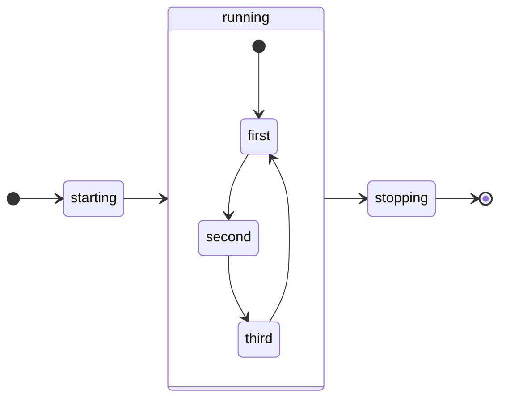

# StateBench
A comparison between Qt's and Boost's state machines.

Following is the state diagram used to draw the comparison:

```mermaid
stateDiagram-v2
direction LR
[*] --> starting
starting --> running

state running {
    [*] --> first
    first --> second
    second --> third
    third --> first
}

running --> stopping
stopping --> [*]
```
